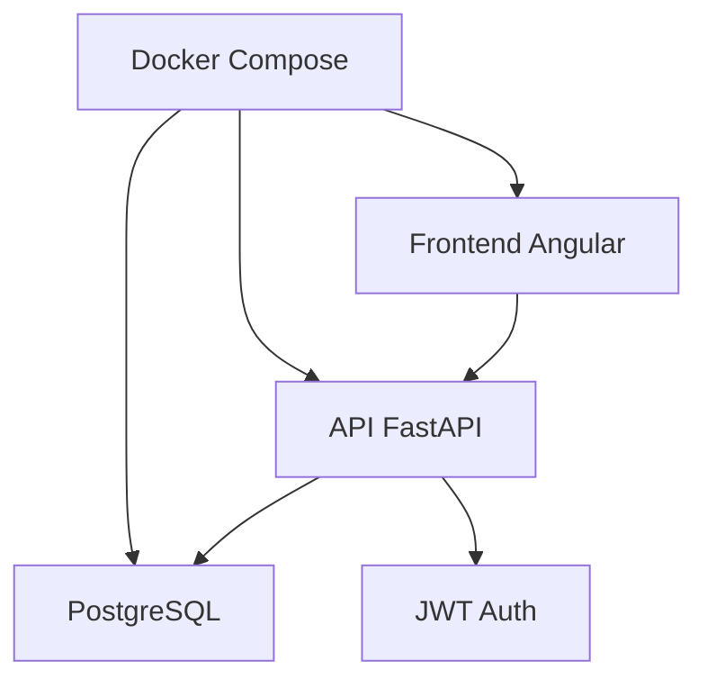

# 🏫 École Privée AI - Système de Gestion Scolaire

[](https://fastapi.tiangolo.com)
[](https://angular.io)
[](https://postgresql.org)
[](https://docker.com)

Application web moderne et complète pour la gestion d'une école privée, développée avec les dernières technologies.

## 🚀 Fonctionnalités

### ✅ Implémentées
- 🔐 **Authentification JWT** - Système de connexion sécurisé
- 👥 **Gestion des utilisateurs** - Étudiants, professeurs, administrateurs
- 📚 **Gestion des classes** - Organisation par niveaux et sections
- 📖 **Gestion des matières** - Attribution aux classes et professeurs
- 📝 **Inscriptions** - Système d'inscription des étudiants
- 🔄 **API REST complète** - CRUD pour toutes les entités
- 📊 **Documentation automatique** - Swagger UI intégrée
- 🐳 **Conteneurisation** - Docker et Docker Compose
- 🎭 **Données fictives** - Génération automatique avec Faker
- 🛠️ **Scripts utilitaires** - Peuplement, nettoyage et reset de la DB

### 🚧 En développement
- 🎨 **Interface Angular** - Frontend moderne et responsive
- 📊 **Notes et évaluations** - Système de notation
- ✅ **Présences/absences** - Suivi de l'assiduité
- 📅 **Planning** - Emploi du temps interactif

### 📋 Planifiées
- 💬 **Communication** - Messages et notifications
- 💰 **Facturation** - Gestion des paiements
- 📈 **Rapports** - Statistiques et analyses
- 📱 **Application mobile** - Version mobile native

## 🏗️ Architecture



### Stack technique
- **Frontend**: Angular 17+ avec Angular Material
- **Backend**: FastAPI (Python 3.11)
- **Base de données**: PostgreSQL 15
- **Authentification**: JWT avec bcrypt
- **Conteneurisation**: Docker + Docker Compose
- **Orchestration**: Kubernetes (prévu)

## 📁 Structure du projet

```
ecole-prive-AI/
├── 📁 backend/                 # API FastAPI
│   ├── 📁 app/
│   │   ├── 📁 models/         # Modèles SQLAlchemy
│   │   ├── 📁 schemas/        # Schémas Pydantic
│   │   ├── 📁 routers/        # Endpoints API
│   │   ├── 📄 config.py       # Configuration
│   │   ├── 📄 database.py     # Configuration DB
│   │   ├── 📄 auth.py         # Authentification JWT
│   │   └── 📄 main.py         # Application principale
│   ├── 📄 requirements.txt    # Dépendances Python
│   ├── 📄 Dockerfile         # Image Docker
│   └── 📄 .env               # Variables d'environnement
├── 📁 frontend/               # Application Angular (à venir)
├── 📁 database/               # Scripts PostgreSQL
├── 📁 k8s/                   # Manifests Kubernetes (à venir)
├── 📄 docker-compose.yml     # Orchestration locale
├── 📄 DOCUMENTATION.md       # Documentation technique
├── 📄 CHANGELOG.md           # Historique des modifications
└── 📄 DEVELOPMENT_GUIDE.md   # Guide développeur
```

## 🚀 Démarrage rapide

### Prérequis
- Docker et Docker Compose
- Git

### Installation

1. **Cloner le repository**
   ```bash
   git clone https://github.com/hamza-webdev/ecole-prive-AI.git
   cd ecole-prive-AI
   ```

2. **Démarrer l'environnement**
   ```bash
   # Démarrer PostgreSQL
   docker-compose up -d postgres

   # Démarrer le backend
   docker-compose up -d backend
   ```

3. **Peupler la base avec des données fictives**
   ```bash
   # Générer des données de test avec Faker
   make seed
   # ou
   docker-compose exec backend python seed.py
   ```

4. **Vérifier l'installation**
   ```bash
   # Test de l'API
   curl http://localhost:8000

   # Accéder à la documentation
   open http://localhost:8000/docs
   ```

### Accès aux services

| Service | URL | Description |
|---------|-----|-------------|
| 🔗 API Backend | http://localhost:8000 | API REST FastAPI |
| 📚 Documentation | http://localhost:8000/docs | Swagger UI |
| 🗄️ Base de données | localhost:5432 | PostgreSQL |
| 🎨 Frontend | http://localhost:4200 | Angular (à venir) |

## 🎭 Données fictives générées

Le script de peuplement crée automatiquement :

- **1 administrateur** : `admin@ecole-prive.fr` / `admin123`
- **15 enseignants** avec profils complets et spécialisations
- **100 étudiants** avec informations personnelles et contacts parents
- **50 parents** avec coordonnées
- **23 classes** (primaire, collège, lycée) avec sections
- **183 matières** assignées aux classes avec enseignants
- **100 inscriptions** d'étudiants dans les classes

Toutes les données sont générées avec **Faker** en français pour un réalisme optimal.

## 📖 API Endpoints

### Authentification
- `POST /auth/login` - Connexion utilisateur

### Utilisateurs
- `GET /users/` - Lister les utilisateurs
- `POST /users/` - Créer un utilisateur
- `GET /users/me` - Profil utilisateur connecté
- `GET /users/{id}` - Utilisateur par ID
- `PUT /users/{id}` - Mettre à jour un utilisateur
- `DELETE /users/{id}` - Supprimer un utilisateur

### Étudiants
- `GET /students/` - Lister les étudiants
- `POST /students/` - Créer un étudiant
- `GET /students/{id}` - Étudiant par ID
- `PUT /students/{id}` - Mettre à jour un étudiant
- `DELETE /students/{id}` - Supprimer un étudiant

### Professeurs
- `GET /teachers/` - Lister les professeurs
- `POST /teachers/` - Créer un professeur
- `GET /teachers/{id}` - Professeur par ID
- `PUT /teachers/{id}` - Mettre à jour un professeur
- `DELETE /teachers/{id}` - Supprimer un professeur

### Classes
- `GET /classes/` - Lister les classes
- `POST /classes/` - Créer une classe
- `GET /classes/{id}` - Classe par ID
- `PUT /classes/{id}` - Mettre à jour une classe
- `DELETE /classes/{id}` - Supprimer une classe

### Matières
- `GET /subjects/` - Lister les matières
- `POST /subjects/` - Créer une matière
- `GET /subjects/{id}` - Matière par ID
- `PUT /subjects/{id}` - Mettre à jour une matière
- `DELETE /subjects/{id}` - Supprimer une matière

## 🔧 Commandes utiles

### Docker
```bash
# Voir les logs
docker-compose logs backend

# Redémarrer un service
docker-compose restart backend

# Arrêter tous les services
docker-compose down

# Reconstruire les images
docker-compose build
```

### Base de données
```bash
# Accéder à PostgreSQL
docker-compose exec postgres psql -U ecole_user -d ecole_db

# Sauvegarder la base
docker-compose exec postgres pg_dump -U ecole_user ecole_db > backup.sql
```

### Données fictives (Faker)
```bash
# Peupler avec des données de test
make seed

# Vider la base de données
make clear

# Réinitialiser complètement (vider + repeupler)
make reset

# Installation complète (build + up + seed)
make install
```

### Makefile - Commandes disponibles
```bash
# Afficher l'aide
make help

# Services Docker
make up          # Démarrer tous les services
make down        # Arrêter tous les services
make restart     # Redémarrer le backend
make logs        # Voir les logs du backend

# Base de données
make seed        # Peupler avec des données fictives
make clear       # Vider la base de données
make reset       # Réinitialiser (vider + repeupler)

# Développement
make shell       # Accéder au shell du conteneur backend
make db-shell    # Accéder au shell PostgreSQL
make status      # Afficher le statut des services
```

## 🧪 Tests

```bash
# Tests backend (à implémenter)
cd backend
pytest

# Tests frontend (à implémenter)
cd frontend
ng test
```

## 📚 Documentation

- 📖 [**Documentation technique**](./DOCUMENTATION.md) - Architecture et implémentation
- 📝 [**Guide développeur**](./DEVELOPMENT_GUIDE.md) - Instructions pour contribuer
- 📋 [**Changelog**](./CHANGELOG.md) - Historique des modifications
- 🔗 [**API Documentation**](http://localhost:8000/docs) - Swagger UI en direct

## 🤝 Contribution

1. Fork le projet
2. Créer une branche feature (`git checkout -b feature/nouvelle-fonctionnalite`)
3. Commit les changements (`git commit -m 'feat: ajouter nouvelle fonctionnalité'`)
4. Push vers la branche (`git push origin feature/nouvelle-fonctionnalite`)
5. Ouvrir une Pull Request

Voir le [Guide développeur](./DEVELOPMENT_GUIDE.md) pour plus de détails.

## 📄 Licence

Ce projet est sous licence MIT. Voir le fichier [LICENSE](LICENSE) pour plus de détails.

## 👨‍💻 Auteur

**Hamza Bedoui**
- GitHub: [@hamza-webdev](https://github.com/hamza-webdev)
- Email: hamza.bedoui@example.com

## 🙏 Remerciements

- [FastAPI](https://fastapi.tiangolo.com/) pour l'excellent framework API
- [Angular](https://angular.io/) pour le framework frontend
- [PostgreSQL](https://postgresql.org/) pour la base de données robuste
- [Docker](https://docker.com/) pour la conteneurisation

---

⭐ **N'hésitez pas à donner une étoile si ce projet vous plaît !**
